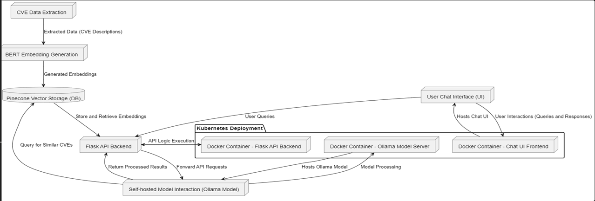

### Explanation of Components:

1. **CVE Data Extraction (A):** 
   - Extracts CVE data (descriptions and metadata) from JSON files, preparing them for embedding generation.

2. **BERT Embedding Generation (B):**
   - Processes the CVE descriptions using a BERT model to generate vector embeddings. These embeddings are high-dimensional representations of the textual data.

3. **Pinecone Vector Storage (DB) (C):**
   - A database where the generated embeddings are stored. Pinecone provides capabilities for efficient similarity searches, allowing quick retrieval of relevant CVEs based on their embeddings.

4. **Flask API Backend (D):**
   - The central component that handles incoming API requests from the User Interface (UI). It interacts with the Pinecone database to retrieve similar CVEs based on the user's query and forwards the query to the Ollama Model Server if further processing is needed.

5. **Self-hosted Model Interaction (Ollama Model) (E):**
   - This component represents the interaction with the Ollama Model Server. It processes the query using the self-hosted model, which could be a language model used to generate or enhance responses.

6. **User Chat Interface (UI) (F):**
   - The frontend interface where users input their queries and receive responses. This UI sends the queries to the Flask API backend and displays the results to the user.

7. **Kubernetes Deployment:**
   - **Docker Container - Flask API Backend (G):** Hosts the Flask API backend within a Kubernetes environment.
   - **Docker Container - Chat UI Frontend (H):** Runs the Chat UI, allowing users to interact with the system.
   - **Docker Container - Ollama Model Server (I):** Hosts the self-hosted Ollama model, which is responsible for processing and understanding user queries.

### Data Flow:

- **User Query:** A user inputs a query through the Chat UI, which is sent to the Flask API backend.
- **Embedding Retrieval:** The Flask API retrieves relevant embeddings from the Pinecone database based on the query.
- **Model Interaction:** If needed, the query is forwarded to the Ollama Model Server for deeper processing. The Ollama model can use the embeddings or additional data to refine the response.
- **Response Generation:** The processed results are sent back through the Flask API to the Chat UI, where the user sees the final response.

